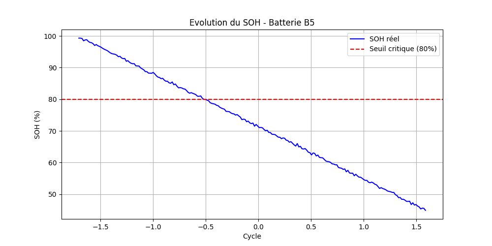

# Battery Health Prediction System

An intelligent Machine Learning system designed to predict battery degradation indicators including **State of Health (SOH)**, **Remaining Useful Life (RUL)**, and battery condition classification.

This project combines **data preprocessing**, **predictive modeling**, **time-series analysis**, and **REST API deployment** to provide a complete predictive maintenance solution for battery monitoring applications.

---

## Overview

Battery degradation prediction plays a critical role in:

- Electric Vehicles (EV)
- Energy Storage Systems
- IoT Devices
- Industrial Predictive Maintenance
- Smart Battery Management Systems (BMS)

This project uses Machine Learning techniques to analyze battery operational data and estimate battery performance and lifespan.

---

## Key Features

✔️ Battery State of Health (SOH) Prediction  
✔️ Remaining Useful Life (RUL) Estimation  
✔️ Battery Condition Classification  
✔️ Automated Data Preprocessing & Normalization  
✔️ Time-Series Visualization of Battery Degradation  
✔️ Model Persistence using Pickle  
✔️ REST API Deployment with FastAPI  
✔️ Professional Modular Architecture  

---

## Machine Learning Pipeline
```text
1. Data Loading
2. Data Cleaning
3. Feature Engineering
4. Feature Normalization
5. Model Training
6. Model Evaluation
7. Prediction Generation
8. Visualization
9. API Deployment
```
---

## Technologies Used

| Category | Technologies |
|---|---|
| Programming Language | Python 3.10 |
| Data Processing | Pandas, NumPy |
| Machine Learning | Scikit-learn |
| Visualization | Matplotlib |
| API Framework | FastAPI |
| Model Serialization | Pickle / Joblib |
| Server | Uvicorn |

---

## Project Structure

```bash
battery-health-prediction/
│
├──Battery_dataset.csv(Dataset)
│
├── model/
│   ├── battery_classifier.pkl
│   ├── scaler.pkl
│   ├── soh_model.pkl
│   └── rul_model.pkl
│
├── main.py
├── api.py
├── requirements.txt
├── README.md
└── .gitignore
```

---

## Installation

### 1️⃣ Clone the Repository

```bash
git clone https://github.com/MARIEMSIBBA/battery-health-prediction.git
```

### 2️⃣ Navigate to the Project Directory

```bash
cd battery-health-prediction
```

### 3️⃣ Install Dependencies

```bash
pip install -r requirements.txt
```

---

## ▶️ Running the Project

Execute the main training and prediction pipeline:

```bash
python main.py
```

Example output:

```bash
MAE=0.000 | R²=1.000
RUL MAE: 15.06
Accuracy classificateur : 95.6%
```

---

## API Deployment

### Start the API Server

```bash
uvicorn api:app --reload
```

### Access Swagger Documentation

```
http://127.0.0.1:8000/docs
```

---

## Visualization

The system generates time-series visualizations representing battery degradation behavior over charging cycles.



---

## Model Performance

| Model | Metric | Performance |
|---|---|---|
| SOH Prediction | R² Score | 1.000 |
| RUL Prediction | MAE | ≈ 15 |
| Battery Classification | Accuracy | 95.6% |

---

## Core Functionalities

### SOH Prediction
Predicts the current State of Health percentage of a battery.

### RUL Estimation
Estimates the remaining operational cycles before battery failure.

### Battery Classification
Classifies batteries into health categories:
- ✅ Healthy
- ⚠️ Moderate
- ❌ Degraded

---

## 🧪 Example Workflow

```text
Battery Dataset
      ↓
Preprocessing & Cleaning
      ↓
Feature Scaling
      ↓
ML Model Training
      ↓
Prediction & Evaluation
      ↓
Visualization
      ↓
API Deployment
```

---

## Applications

This project can be integrated into:

- Electric Vehicle Monitoring Systems
- Smart Energy Systems
- IoT-Based Battery Monitoring
- Industrial Maintenance Platforms
- Embedded AI Systems

---

## Future Improvements

- [ ] Deep Learning Integration
- [ ] Real-Time IoT Sensor Data
- [ ] Streamlit Dashboard
- [ ] Docker Deployment
- [ ] Cloud Deployment
- [ ] Advanced Time-Series Forecasting

---

## Author

**Sibba Mariem**  
Master's Student — Computer Engineering & Embedded Systems  
Ibn Zohr University, Agadir, Morocco

---
